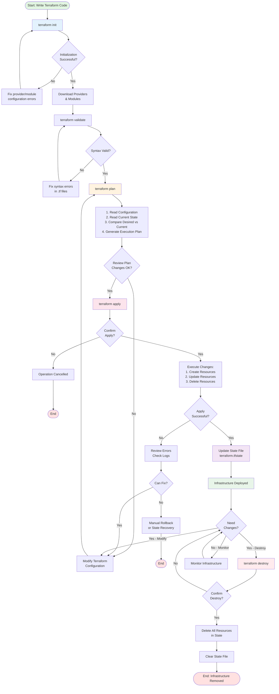

# Terraform execution plan and workflow

```mermaid
graph TD
    Start([Start: Write Terraform Code]) --> Init[terraform init]

    Init --> InitCheck{Initialization<br/>Successful?}
    InitCheck -->|No| InitError[Fix provider/module<br/>configuration errors]
    InitError --> Init
    InitCheck -->|Yes| InitSuccess[Download Providers<br/>& Modules]

    InitSuccess --> Validate[terraform validate]
    Validate --> ValidCheck{Syntax Valid?}
    ValidCheck -->|No| ValidError[Fix syntax errors<br/>in .tf files]
    ValidError --> Validate
    ValidCheck -->|Yes| Plan[terraform plan]

    Plan --> PlanProcess[1. Read Configuration<br/>2. Read Current State<br/>3. Compare Desired vs Current<br/>4. Generate Execution Plan]

    PlanProcess --> PlanReview{Review Plan<br/>Changes OK?}
    PlanReview -->|No| ModifyCode[Modify Terraform<br/>Configuration]
    ModifyCode --> Plan

    PlanReview -->|Yes| Apply[terraform apply]

    Apply --> ApplyConfirm{Confirm<br/>Apply?}
    ApplyConfirm -->|No| Cancel[Operation Cancelled]
    Cancel --> End1([End])

    ApplyConfirm -->|Yes| ApplyProcess[Execute Changes:<br/>1. Create Resources<br/>2. Update Resources<br/>3. Delete Resources]

    ApplyProcess --> ApplyResult{Apply<br/>Successful?}
    ApplyResult -->|No| ApplyError[Review Errors<br/>Check Logs]
    ApplyError --> FixError{Can Fix?}
    FixError -->|Yes| ModifyCode
    FixError -->|No| Rollback[Manual Rollback<br/>or State Recovery]
    Rollback --> End2([End])

    ApplyResult -->|Yes| UpdateState[Update State File<br/>terraform.tfstate]

    UpdateState --> Deployed[Infrastructure Deployed]

    Deployed --> Maintain{Need<br/>Changes?}
    Maintain -->|Yes - Modify| ModifyCode
    Maintain -->|Yes - Destroy| Destroy[terraform destroy]
    Maintain -->|No - Monitor| Monitor[Monitor Infrastructure]

    Destroy --> DestroyConfirm{Confirm<br/>Destroy?}
    DestroyConfirm -->|No| Maintain
    DestroyConfirm -->|Yes| DestroyProcess[Delete All Resources<br/>in State]

    DestroyProcess --> DestroyState[Clear State File]
    DestroyState --> End3([End: Infrastructure Removed])

    Monitor --> Maintain

    style Start fill:#e1f5e1
    style End1 fill:#ffe1e1
    style End2 fill:#ffe1e1
    style End3 fill:#ffe1e1
    style Init fill:#e3f2fd
    style Plan fill:#fff3e0
    style Apply fill:#fce4ec
    style Deployed fill:#e8f5e9
    style UpdateState fill:#f3e5f5
    style Destroy fill:#ffebee
```
