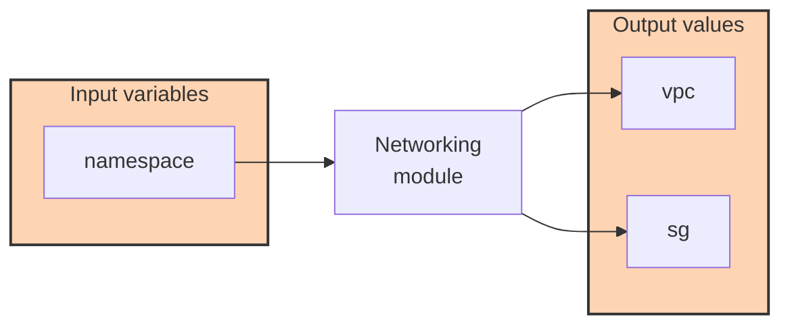
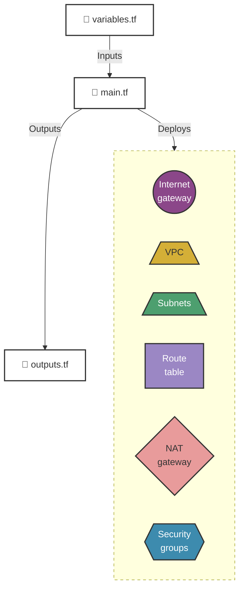
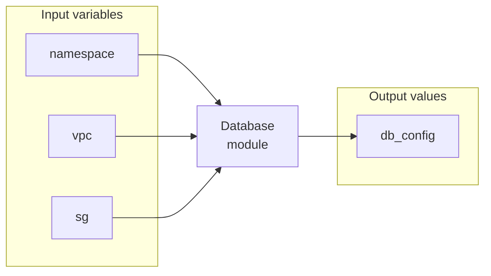
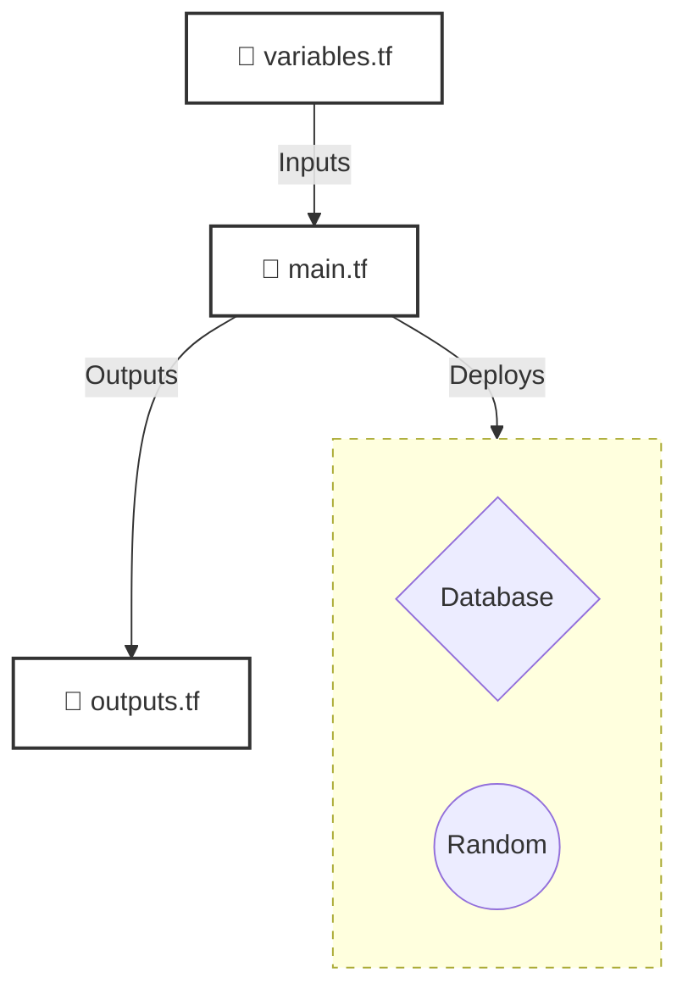

# Modules

## Networking Module

### Module structure

### Managed resources provisioned by the networking module

## Database Module

### Module structure

### Managed resources provisioned by the database module

