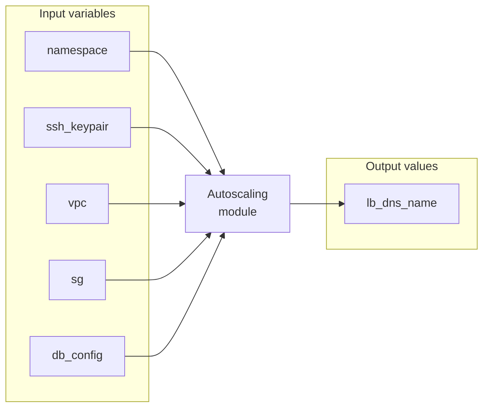

# Terraform in Action - Chapter 4
* [Github anhbkpro](https://github.com/anhbkpro/terraform-in-action)

# Modules

## Networking Module

### Module structure

### Managed resources provisioned by the networking module

```mermaid
flowchart TB
    variables["📄 variables.tf"]
    main["📄 main.tf"]
    outputs["📄 outputs.tf"]

    variables -->|Inputs| main
    main -->|Outputs| outputs

    main -->|Deploys| resources

    subgraph resources[" "]
        igw((Internet<br/>gateway))
        vpc[/VPC\]
        subnets[/Subnets\]
        rt[Route<br/>table]
        nat{NAT<br/>gateway}
        sg{{Security<br/>groups}}
    end

    style resources stroke-dasharray: 5 5
    style igw fill:#8b4789,stroke:#333,stroke-width:2px,color:#fff
    style vpc fill:#d4af37,stroke:#333,stroke-width:2px
    style subnets fill:#4d9f6f,stroke:#333,stroke-width:2px,color:#fff
    style rt fill:#9b87c4,stroke:#333,stroke-width:2px,color:#fff
    style nat fill:#e89b9b,stroke:#333,stroke-width:2px
    style sg fill:#3d8bae,stroke:#333,stroke-width:2px,color:#fff

    classDef fileStyle fill:#fff,stroke:#333,stroke-width:2px
    class variables,main,outputs fileStyle
```

## Database Module

### Module structure

### Managed resources provisioned by the database module

```mermaid
flowchart TB
    variables["📄 variables.tf"]
    main["📄 main.tf"]
    outputs["📄 outputs.tf"]

    variables -->|Inputs| main
    main -->|Outputs| outputs

    main -->|Deploys| resources

    subgraph resources[" "]
        direction LR
        db{Database}
        random((Random))
    end

    style resources stroke-dasharray: 5 5
    classDef fileStyle fill:#fff,stroke:#333,stroke-width:2px
    class variables,main,outputs fileStyle
```

## AutoScaling Module

### Module structure

- `vpc` and `sg` are the outputs from the Networking module
- `db_config` is the output from the Database module

### Managed resources provisioned by the AutoScaling module

```mermaid
flowchart TB
    variables["📄 variables.tf"]
    main["📄 main.tf"]
    outputs["📄 outputs.tf"]

    variables -->|Inputs| main
    main -->|Outputs| outputs

    main -->|Deploys| resources

    subgraph resources[" "]
        lt((Launch<br/>template))
        iam[/IAM\]
        tg{Target<br/>group}
        lblistn[Load<br/>balancer<br/>listener]
        lb[Load<br/>balancer]
        asg{{Autoscaling<br/>group}}
        ip[/Instance<br/>profile\]
    end

    style resources stroke-dasharray: 5 5
    style lt fill:#8b4789,stroke:#333,stroke-width:2px,color:#fff
    style iam fill:#d4af37,stroke:#333,stroke-width:2px
    style tg fill:#e89b9b,stroke:#333,stroke-width:2px
    style lblistn fill:#8b4789,stroke:#333,stroke-width:2px,color:#fff
    style lb fill:#9b87c4,stroke:#333,stroke-width:2px,color:#fff
    style asg fill:#3d8bae,stroke:#333,stroke-width:2px,color:#fff
    style ip fill:#4d9f6f,stroke:#333,stroke-width:2px,color:#fff

    classDef fileStyle fill:#fff,stroke:#333,stroke-width:2px
    class variables,main,outputs fileStyle
```

